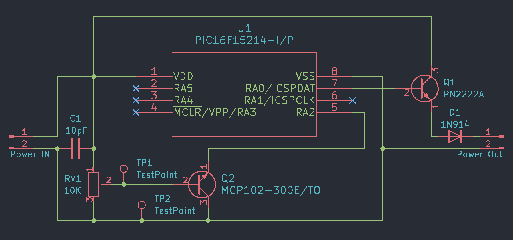
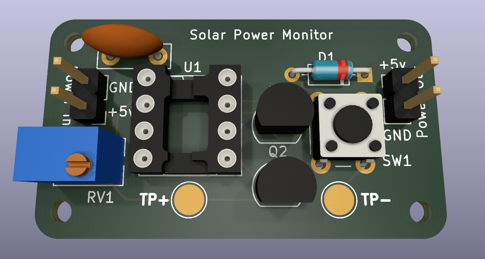
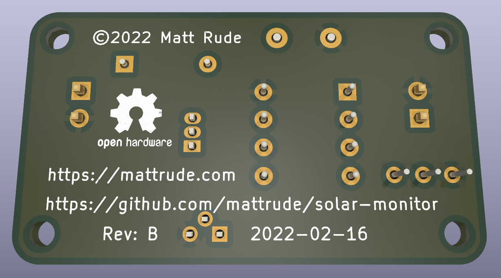

# Solar Monitor

A simple solution to prevent a solar powered LoRaWAN gateway from going into brownout when the batteries drop in voltages.

## The Backstory

I have a solar powered [Raspberry Pi](https://www.raspberrypi.org/) + [RAK2245](https://store.rakwireless.com/products/rak2245-pi-hat) + [RAK2013](https://store.rakwireless.com/products/rak2013-cellular-pi-hat) that has a problem where when it gets cold out, the batteries don't have the Amps to power the gateway when the sun comes up.  This puts the gateway into a brownout state where the cellular module disconnects and will not reconnect until the system is rebooted.

I have learned that a few minutes delay will resolve this issue, allow the batteries to charge and the system to boot correctly.  This project is an attempt to automate this task.

## Theory of Operation

## Software

* [KiCad EDA](https://www.kicad.org/) - Version 6.0.2 - The Schematic & Board softare
* [MPLAB X IDE](https://www.microchip.com/en-us/tools-resources/develop/mplab-x-ide) - Version 6.0.0 - Software used to build the C code
  * [XC8](https://www.microchip.com/en-us/tools-resources/develop/mplab-xc-compilers) - Version 2.32 - The C compiler (A part of MPLAB X IDE)

## Hardware (BOM)

| **Identifier** | **Qty** | **Part #**      | **Description**    | **DigiKey**                                                                                                                      |
|:--------------:|:-------:|-----------------|--------------------|----------------------------------------------------------------------------------------------------------------------------------|
|       U1       | 1       | PIC16F15214-I/P | Microcontroller    | [150-PIC16F15214-I/P-ND](https://www.digikey.com/en/products/detail/microchip-technology/PIC16F15214-I-P/12807471)               |
|       Q1       | 1       | PN2222A         | Transistor         | [PN2222AFS-ND](https://www.digikey.com/en/products/detail/onsemi/PN2222ABU/6534)                                                 |
|       Q2       | 1       | MCP102-300E/TO  | Voltage Supervisor | [MCP102-300E/TO-ND](https://www.digikey.com/en/products/detail/microchip-technology/MCP102-300E-TO/716307)                       |
|       C1       | 1       | 10pF            | Ceramic Capacitor  | [K100K15C0GF53L2-ND](https://www.digikey.com/en/products/detail/vishay-beyschlag-draloric-bc-components/K100K15C0GF53L2/2820158) |
|       D1       | 1       | 1N914           | Diode              | [1N914FS-ND](https://www.digikey.com/en/products/detail/onsemi/1N914/978749)                                                     |
|       RV1      | 1       | PV36W103C01B00  | 10K Ohm Trimmer    | [490-2875-ND](https://www.digikey.com/en/products/detail/bourns-inc/PV36W103C01B00/666502)                                       |

## Schematic

**Schematic**

## Board

**The Top of the Board**

**The Bottom of the Board**

